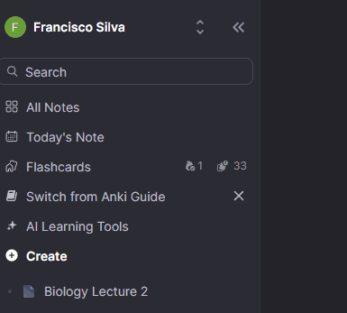
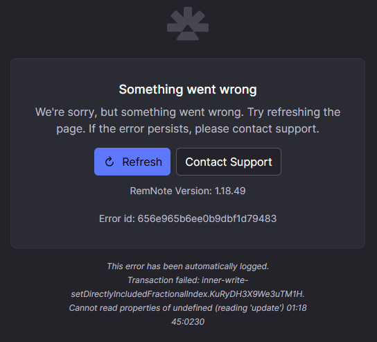

<!-- This Heuristic Evaluation Workbook replicates the one proposed by the 
Nielsen Norman Group available at: https://media.nngroup.com/media/articles/attachments/Heuristic_Evaluation_Workbook_-_Nielsen_Norman_Group.pdf
-->

**Evaluator**: Francisco Silva  
**Date**: 26-02-2025  
**Product**: RemNote  

Severity Scale adopted: We adopted a 5-point severity scale to classify usability issues found during the heuristic evaluation. 
- **1 (Cosmetic issue)** – No impact on usability; fixing is optional.
- **2 (Minor problem)** – Slight usability issue; should be fixed if possible.
- **3 (Major problem)** – Causes difficulty; should be fixed as a high priority.
- **4 (Severe problem)** – Significantly hinders usability; must be addressed urgently.
- **5 (Usability catastrophe)** – Prevents task completion; requires immediate action.

Severity Scale adopted: [[severity_scale_heuristic_evaluation]]
Summary of each usability heuristic: [here](https://media.nngroup.com/media/articles/attachments/Heuristic_Summary1-compressed.pdf)

# 1 Visibility of System Status
>	The design should always keep users informed about what is going on, through appropriate feedback within a reasonable amount of time. 
>	- Does the design clearly communicate its state?
>	- Is feedback presented quickly after user actions?

| **Issue**       | **Severity** | Recommendation |
| --------------- | ------------ | -------------- |
| Website loading is a little slow | 1 |  |

# 2 Match Between System and The Real World
>	The design should speak the users' language. Use words, phrases, and concepts familiar to the user, rather than internal jargon. Follow real-world conventions, making information appear in a natural and logical order. 
>	- Will user be familiar with the terminology used in the design? 
>	- Do the design’s controls follow real-world conventions?

| **Issue**       | **Severity** | Recommendation |
| --------------- | ------------ | -------------- |
| Side bar options are confusing  | 2 | Simplify side bar by removing specific/complex features |

# 3 User Control and Freedom
>	Users often perform actions by mistake. They need a clearly marked "emergency exit" to leave the unwanted action without having to go through an extended process. 
>	- Does the design allow users to go back a step in the process? 
>	- Are exit links easily discoverable? 
>	- Can users easily cancel an action? 
>	- Is Undo and Redo supported?

| **Issue**       | **Severity** | Recommendation |
| --------------- | ------------ | -------------- |
| It is not possible to close a document edit | 1  | Add a close option at document top right |
| Lack of home button to reset flow | 3  | Create a home button and make it visible so users can have an easy way out |

# 4 Consistency and Standards
>	Users should not have to wonder whether different words, situations, or actions mean the same thing. Follow platform and industry conventions. 
>	- Does the design follow industry conventions? 
>	- Are visual treatments used consistently throughout the design?

| **Issue**       | **Severity** | Recommendation |
| --------------- | ------------ | -------------- |
| Expected `settings` option to be on Top-right/Bottom-left of the screen but hidden in a drop down under user name | 2 |  Create a more obvious and intuitive way to access settings menu |

# 5 Error Prevention
>	Good error messages are important, but the best designs carefully prevent problems from occurring in the first place. Either eliminate error-prone conditions, or check for them and present users with a confirmation option before they commit to the action. 
>	- Does the design prevent slips by using helpful constraints? 
>	- Does the design warn users before they perform risky actions?

| **Issue**       | **Severity** | Recommendation |
| --------------- | ------------ | -------------- |
| Removing side bar feature has no confirmation and could be susceptible to a mouse slip | 3 |  Add confirmation pop up and a way to revert the change |

# 6 Recognition Rather than Recall
>	Minimize the user's memory load by making elements, actions, and options visible. The user should not have to remember information from one part of the interface to another. Information required to use the design (e.g. field labels or menu items) should be visible or easily retrievable when needed. 
>	- Does the design keep important information visible, so that users do not have to memorize it? 
>	- Does the design offer help in-context?

| **Issue**       | **Severity** | Recommendation |
| --------------- | ------------ | -------------- |
| Something wrong | 3            |                |
| Another thing   | 4            |                |

# 7 Flexibility and Efficiency of Use
>	Shortcuts — hidden from novice users — may speed up the interaction for the expert user such that the design can cater to both inexperienced and experienced users. Allow users to tailor frequent actions. 
>	- Does the design provide accelerators like keyboard shortcuts and touch gestures? 
>	- Is content and funtionality personalized or customized for individual users?

| **Issue**       | **Severity** | Recommendation |
| --------------- | ------------ | -------------- |
| Something wrong | 3            |                |
| Another thing   | 4            |                |
# 8 Aesthetic and Minimalist Design
>	Interfaces should not contain information that is irrelevant or rarely needed. Every extra unit of information in an interface competes with the relevant units of information and diminishes their relative visibility. 
>	- Is the visual design and content focused on the essentials? 
>	- Have all distracting, unnescessary elements been removed?

| **Issue**       | **Severity** | Recommendation |
| --------------- | ------------ | -------------- |
| Overwhelming number of options | 2            | Reduce number of options; maybe hiding some more complex in its own category |

# 9 Help Users Recognize, Diagnose, and Recover from Errors
>	Error messages should be expressed in plain language (no error codes), precisely indicate the problem, and constructively suggest a solution. 
>	- Does the design use traditional error message visuals, like bold, red text? 
>	- Does the design offer a solution that solves the error immediately?

| **Issue**       | **Severity** | Recommendation |
| --------------- | ------------ | -------------- |
| Unknown Error | 4 | Figure out what is causing the error and fix it |

# 10 Help and Documentation
>	It’s best if the system doesn’t need any additional explanation. However, it may be necessary to provide documentation to help users understand how to complete their tasks. 
>	- Is help documentation easy to search? 
>	- Is help provided in context right at the moment when the user requires it?

| **Issue**       | **Severity** | Recommendation |
| --------------- | ------------ | -------------- |
| Lack of FAQs section | 3  | The interface and its features are not very obvious to get started with; A FAQs page would be very useful |
